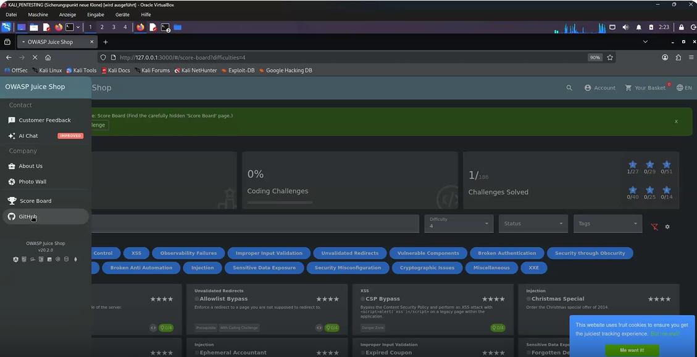
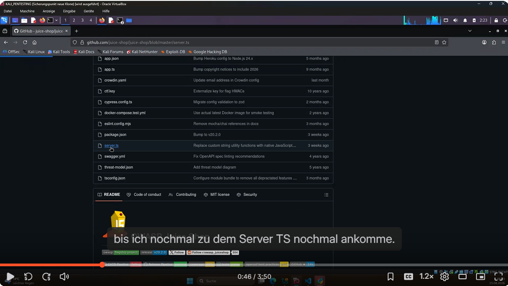
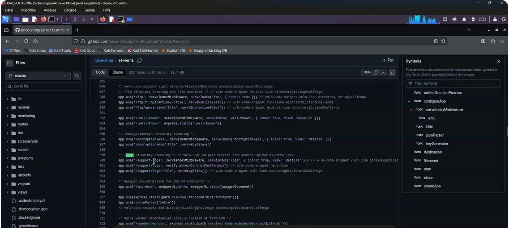
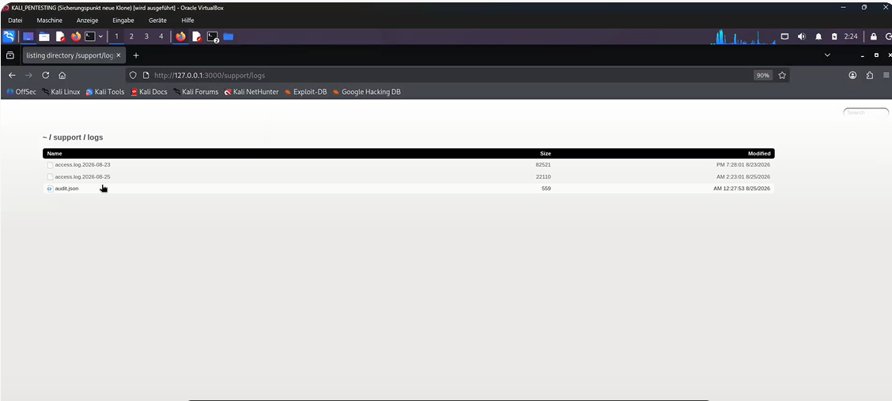
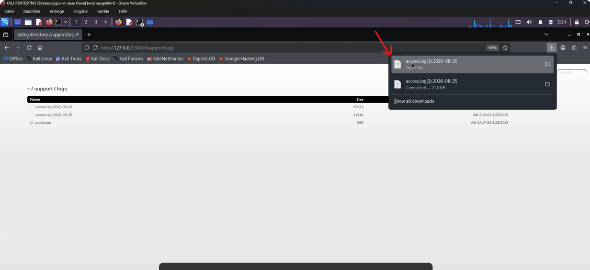
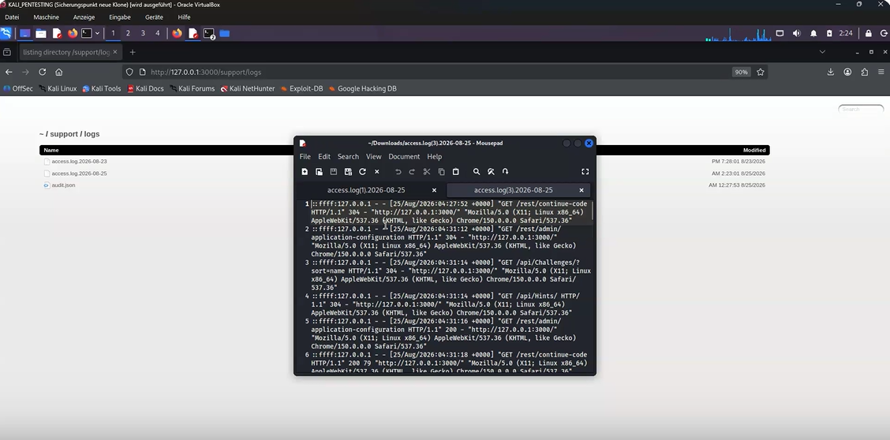
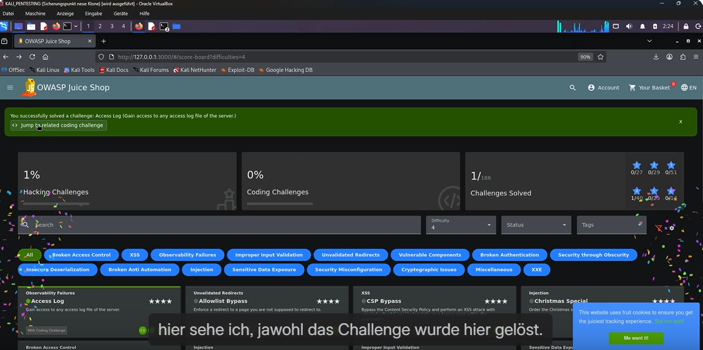

# Access Log

## Table of Contents

- [Description](#description)
  - [Vulnerability Analysis](#vulnerability-analysis)
  - [Exploitation – Step by Step](#exploitation--step-by-step)
  - [Mitigation / Fix](#mitigation--fix)
- [References](#references)

## Description

> **Note:** Juice Shop is an intentionally vulnerable application that must only be operated for training and testing purposes in an isolated environment.


### Vulnerability Analysis

For internal purposes, Juice Shop mounts a directory listing endpoint at the path `/support/logs` within the application. Simplified, the server-side configuration (Express.js) looks roughly like this:

```javascript
app.use('/support/logs', serveIndexMiddleware, serveIndex('logs', { icons: true, view: 'details' }))
```

This middleware setup lists the contents of the `logs` directory on the server, including all access log files stored there, and allows them to be downloaded directly via the browser.

The issues here are:

1. **Lack of real access control:** The endpoint does not robustly verify whether the requesting client actually belongs to the support team or holds an authorized role. Protection essentially relies on the path `/support/logs` not being publicly linked and therefore "undiscoverable" — a classic example of **security through obscurity**.
2. **Directory listing enabled:** Instead of serving individual, explicitly released files, the entire directory contents are displayed. An attacker therefore does not need to know the exact file name of the log file, but can simply have the list displayed.
3. **Sensitive content in the logs:** Access logs typically record IP addresses, requested URLs including query parameters, user agents, and timestamps, and potentially also sensitive data accidentally transmitted in the URL (e.g., session tokens, coupon codes, or other parameters).

Since the path is not linked anywhere in the visible application, an attacker must first locate it through **directory enumeration** (brute-forcing common path names).

---

### Exploitation – Step by Step

**1. Use the server implementation to locate the logs endpoint**

Navigate to the [OWASP Juice Shop GitHub repository](https://github.com/juice-shop/juice-shop) and inspect the source code. Inside `server.ts`, you will find the `/support/logs` endpoint defined. This gives you a solid starting point for what to look for when performing directory enumeration.





**2. Open the directory in the browser**

```
http://127.0.0.1:3000/support/logs
```

The server responds with a directory listing containing all the log files stored there.



**3. Download and open a log file**

Click one of the listed files to download it, or view it directly in the browser. The file contains lines in the typical access log format, including the IP address, timestamp, HTTP method, requested URL, and status code.




**4. Verify success**

Simply opening or accessing any log file from this directory is enough for Juice Shop to mark the challenge as solved (indicated by a green checkmark next to "Access Log" on the Score Board).



---

### Mitigation / Fix

**1. Disable directory listing**

The `serveIndex` middleware, or any automatic listing of directory contents, should generally be disabled for sensitive paths:

```javascript
// Instead of automatic directory listing:
app.use('/support/logs', authenticateSupportRole, express.static('logs', { index: false }))
```

**2. Enforce real authentication and authorization**

Access to `/support/logs` should be protected by middleware that actively checks whether the logged-in user holds an authorized role (e.g., `support` or `admin`), instead of relying on the path being undiscoverable:

```javascript
function requireSupportRole(req, res, next) {
  if (req.user?.role !== 'support' && req.user?.role !== 'admin') {
    return res.status(403).send('Forbidden')
  }
  next()
}
app.use('/support/logs', requireSupportRole, express.static('logs'))
```

**3. Do not rely on "security through obscurity" as the sole protection**

An unlinked path is no substitute for real access control. Sensitive endpoints must be secured regardless of how well-known they are.

**4. Store log files outside the web root**

Log files should generally reside in a directory that cannot be directly served by the web server, or should only be accessible via a dedicated, authenticated backend route.

**5. Keep sensitive data out of logs, or mask it**

Session tokens, coupon codes, or other sensitive parameters should not be transmitted in the URL (but rather, e.g., in the request body or headers), and/or should be automatically masked or redacted in logs.

**6. Apply least privilege and network segmentation**

Internal support/admin endpoints should, where possible, be additionally restricted at the network level (e.g., only reachable from an internal network or via VPN).

**7. Automated tests / scans**

Regular scans with tools such as OWASP ZAP, or targeted directory enumeration as part of penetration tests, help detect accidentally exposed directory listings early and can be integrated into the CI/CD pipeline as a regression test.

## References

- OWASP Juice Shop – Official GitHub Repository: https://github.com/juice-shop/juice-shop
- OWASP Juice Shop – Official Companion Guide (Pwning OWASP Juice Shop): https://pwning.owasp-juice.shop/
- Pwning OWASP Juice Shop – Chapter "Sensitive Data Exposure": https://pwning.owasp-juice.shop/part2/sensitive-data-exposure.html
- CWE-548: Exposure of Information Through Directory Listing – https://cwe.mitre.org/data/definitions/548.html
- OWASP Path Traversal / Information Exposure – https://owasp.org/www-community/attacks/Path_Traversal
