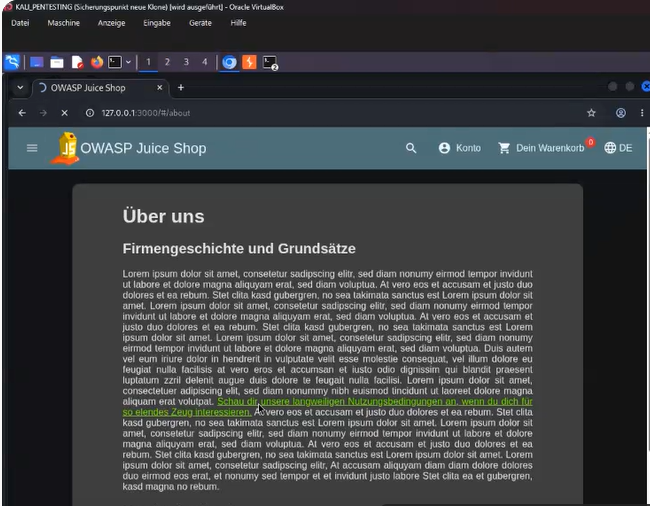
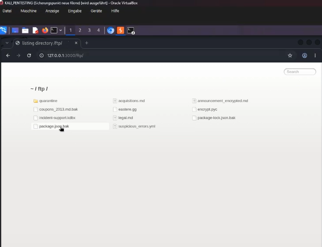
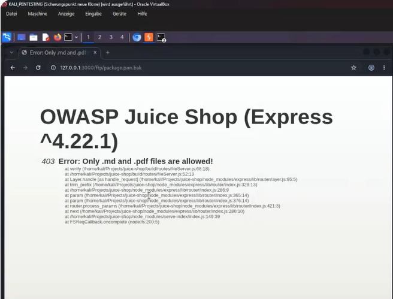
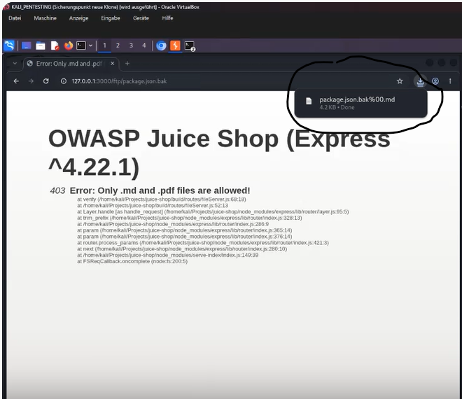
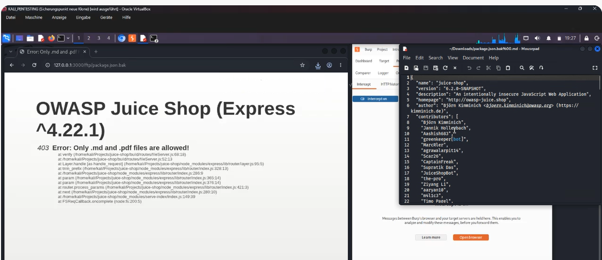
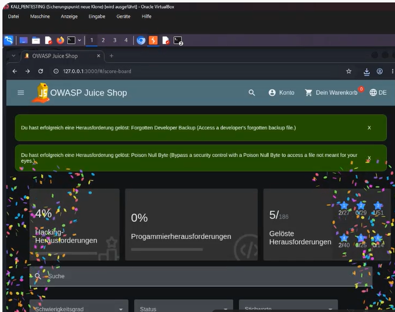

# Forgotten Developer Backup

## Table of Contents

- [Description](#description)
    - [Vulnerability Analysis](#vulnerability-analysis)
    - [Exploitation – Step by Step](#exploitation--step-by-step)
    - [Mitigation / Fix](#mitigation--fix)
- [References](#references)


## Description

:::warning

**Note:** Juice Shop is an intentionally vulnerable application that must only be operated for training and testing purposes in an isolated environment.

:::

### Vulnerability Analysis

Juice Shop exposes a publicly accessible directory at `/ftp` containing various files, originally intended as an internal storage location for documents such as privacy policies or invoicing records. However, this directory also contains a file named `package.json.bak` — a backup copy of `package.json` accidentally left behind by a developer, listing all npm dependencies used, along with their version numbers.

The server only allows downloading files with the extensions `.md` and `.pdf` via the `/ftp` endpoint. When attempting to access `package.json.bak` directly, the server responds with an error ("Only .md and .pdf files are allowed!"), since the file extension check operates solely on the **file name** as passed in the request.

The check is performed server-side, roughly following this pattern (simplified):

```javascript
if (!filename.match(/\.(md|pdf)$/i)) {
  return res.status(403).send('Only .md and .pdf files are allowed!')
}
// The file is then loaded via the file system
fs.readFile(path.join(ftpDir, filename), ...)
```

The critical flaw is that the **whitelist check** uses the complete file name supplied by the client, while the subsequent **file system access** (in older Node.js versions, or in certain underlying C libraries) interprets an embedded **null byte** (`\x00`) within the string as a terminator and ignores everything after it. An attacker can therefore construct a file name that:

1. **for the whitelist check**, looks like an allowed `.md` file (because the string ends in `.md`), but
2. **for the actual file system access**, is truncated at the null byte, causing it to point to the actually desired, otherwise blocked file (`package.json.bak`).

---

### Exploitation – Step by Step

**1. Find the FTP directory**

Navigate to the Juice Shop home page and open the "About Us" section. There you'll find a link (e.g., "Check out our terms of use") that points to `http://localhost:3000/ftp`. Alternatively, open `http://localhost:3000/ftp` directly in the browser.




**2. Inspect the directory contents**

Among the files listed, the directory reveals the following file: `package.json.bak`.

**3. Attempt direct access (fails)**

```
http://localhost:3000/ftp/package.json.bak
```

The server responds with an error message stating that only `.md` and `.pdf` files may be downloaded.



**4. Construct the poison null byte payload**

To bypass the file type check, a URL-encoded null byte (`%00`) is inserted after the actual file name, followed by an allowed extension (`.md`):

```
http://localhost:3000/ftp/package.json.bak%2500.md
```



- For the server-side whitelist check, the string ends in `.md` → the check passes.
- During the actual file access, the string is truncated at the null byte → effectively `package.json.bak` is read and served.

**5. Download and analyze the file**

The browser downloads the file `package.json.bak`. It contains the complete dependency list (`dependencies`/`devDependencies`) of the application, including exact version numbers — information that should not normally be publicly accessible, since it makes it significantly easier for an attacker to search specifically for known vulnerabilities (CVEs) in the npm packages used.



**6. Verify success**

The challenge indicator in Juice Shop (Score Board / green checkmark for "Forgotten Developer Backup") confirms successful completion.



> **Note:** The same technique also works analogously for other challenges in the `/ftp` directory of Juice Shop (e.g., "Forgotten Sales Backup" using `coupons_2013.md.bak%00.md`, or "Easter Egg" using `eastere.gg%00.md`), since all of these endpoints share the same flawed validation logic.

---

### Mitigation / Fix

**1. Normalize input and check for control characters before validation**

File names should be checked server-side for embedded null bytes and other control characters, and the request should be rejected outright if any are found:

```javascript
if (filename.includes('\0')) {
  return res.status(400).send('Invalid filename')
}
```

**2. Use a whitelist based on specific allowed files rather than extensions**

Instead of only checking the file extension, an explicit list of the actually released files (or a server-side mapping from public name to physical path) should be used, so that attackers cannot reference an arbitrary file name within the directory.

**3. Do not store sensitive files in publicly accessible directories**

Backup files (`.bak`), configuration files, or `package.json` backups fundamentally do not belong in a directory served by the web server, regardless of any extension check.

**4. Keep Node.js and the runtime environment up to date**

The underlying null byte weakness is historically rooted in older Node.js/V8 versions or the underlying C bindings; current Node.js versions regularly throw an error when an embedded null byte is present in path arguments. Keeping the runtime environment on a current patch level further mitigates this class of attack.

**5. Re-verify after resolving the actual path**

After resolving the final path actually used by the file system, it should be checked again whether this path corresponds to the expected file (path canonicalization check), rather than relying solely on validating the raw input string.

**6. Apply least privilege to the application process**

The process serving files from the `/ftp` directory should only have read access to exactly the files intended for release, and nothing else.

**7. Automated tests / scans**

Known bypass patterns such as poison null byte payloads (`%00`, embedded control characters) should be integrated into automated security testing (e.g., OWASP ZAP) and into the CI/CD pipeline to prevent regressions.

## References

- OWASP Juice Shop – Official GitHub Repository: https://github.com/juice-shop/juice-shop
- OWASP Juice Shop – Official Companion Guide (Pwning OWASP Juice Shop): https://pwning.owasp-juice.shop/
- Pwning OWASP Juice Shop – Chapter "Improper Input Validation": https://pwning.owasp-juice.shop/part2/improper-input-validation.html
- CWE-158: Improper Neutralization of Null Byte or NUL Character – https://cwe.mitre.org/data/definitions/158.html
