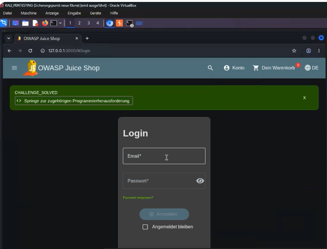
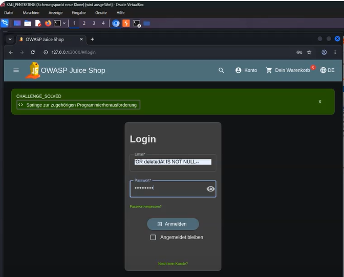
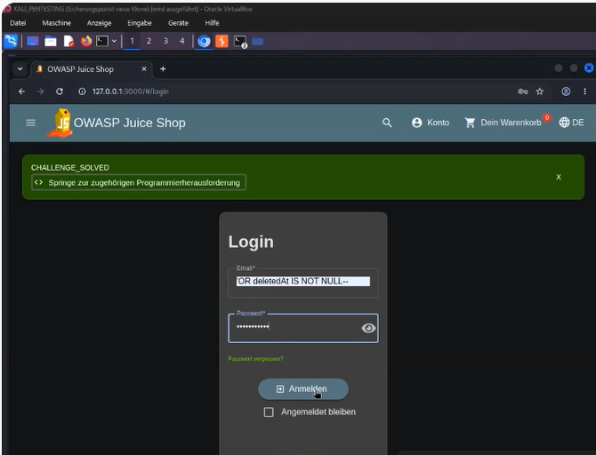
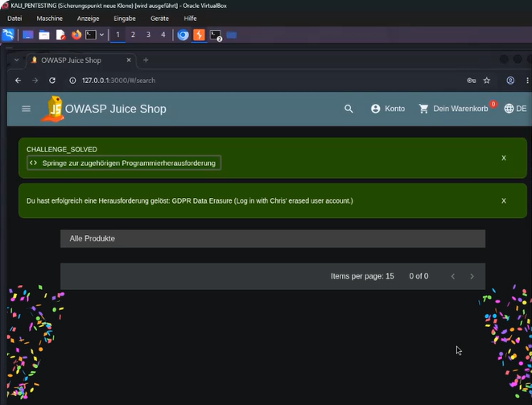

# Login with the (deleted) user account

## Table of Contents

- [Description](#description)
    - [Vulnerability Analysis](#vulnerability-analysis)
    - [Exploitation – Step by Step](#exploitation--step-by-step)
    - [Mitigation / Fix](#mitigation--fix)
- [Further References](#further-references)


## Description
:::warning

**Note:** Juice Shop is an intentionally vulnerable application that must only be operated for training and testing purposes in an isolated environment.

:::

### Vulnerability Analysis

The login endpoint (`POST /rest/user/login`) constructs an SQL query on the server side to verify the email and password. Simplified, the logic looks like this:

```sql
SELECT * FROM Users
WHERE email = '<input_email>'
AND password = '<hash_of_entered_password>'
AND deletedAt IS NULL
```

The issue is that the email input is not parameterized, but instead inserted directly into the query string. This allows an attacker to inject arbitrary SQL code via the email field.

The specific challenge here is that the attacker does not know Chris's exact email address. An attack relying on a specific address such as `chris@juice-sh.op` would therefore not work reliably. Instead, the injection must be crafted to work independently of the email address, specifically targeting a deleted account — identifiable by the `deletedAt` field being set (soft delete). Rather than removing the `email = '...'` condition with a comment, it is replaced with an always-true `OR` condition that specifically targets deleted accounts.

---

### Exploitation – Step by Step

**1. Open the Login Page**

Navigate to `<your-local-host:3000/#/login>`.



**2. Enter the Payload in the Email Field**

Since Chris's email address is unknown, no specific value is required. Instead, the following payload is entered into the email field:

```
' OR deletedAt IS NOT NULL--
```



**3. Enter Any Password**

Since the password check is bypassed by the SQL comment (`--`), the content of this field does not matter, e.g., `test123`.

**4. Submit the Login**

The resulting server-side query effectively becomes:



```sql
SELECT * FROM Users WHERE email = ''
OR deletedAt IS NOT NULL-- ' AND password = '...' AND deletedAt IS NULL
```

Everything after `--` is ignored by the database as a comment. What remains is:

```sql
SELECT * FROM Users WHERE email = '' OR deletedAt IS NOT NULL
```

The condition `email = ''` is false, since no valid email address is empty. However, the `OR deletedAt IS NOT NULL` clause ensures that the query still returns all records with a deletion date set. Since Chris is the only (or first returned) user with a `deletedAt` value in the default Juice Shop database, the query returns his account, and the application logs the attacker in as Chris.

**5. Verify Success**

After logging in, the account overview and order history of the user Chris are displayed. The challenge indicator in Juice Shop (Score Board / green checkmark) confirms successful completion.



> **Note:** If there were multiple deleted user accounts in the database, this payload would return the first result — not necessarily Chris. However, in the default seeded database of Juice Shop, Chris is the only deleted account, so the attack works reliably without requiring knowledge of his email address.

---

### Mitigation / Fix

**1. Use Parameterized Queries / Prepared Statements**

Always use bound parameters instead of string concatenation, e.g., with Sequelize (the Node.js ORM used in Juice Shop itself):

```javascript
await User.findOne({
  where: { email: email, deletedAt: null }
});
```

This ensures user input is never interpreted as part of the SQL syntax.

**2. Use the ORM Consistently and Correctly**

If an ORM such as Sequelize is already in use, avoid raw SQL strings (`sequelize.query(...)` with concatenation) for security-critical queries such as login.

**3. Input Validation**

Validate the email format server-side (e.g., via a regex or library check) before the input is passed to the query.

**4. Principle of Least Privilege**

The database user for the application should have only the minimal permissions necessary, limiting potential damage in the event of a successful injection.

**5. Additional Safeguards for "Deleted" Accounts**

Do not rely solely on a query condition to exclude deleted accounts. Add an explicit status check at the application level (defense in depth), e.g., by verifying the account status again after the database query.

**6. Web Application Firewall (WAF)**

As an additional layer of defense, WAF rules can detect and block typical SQLi patterns (`'--`, `' OR 1=1`, `UNION SELECT`) — though this does not replace fixing the underlying code.

**7. Automated Tests**

Integrate SQLi test cases (e.g., using OWASP ZAP or sqlmap in a controlled test environment) into the CI/CD pipeline to prevent regressions.

---

## Further References

- OWASP Juice Shop – Official GitHub Repository: https://github.com/juice-shop/juice-shop
- OWASP Juice Shop – Official Companion Guide (Pwning OWASP Juice Shop): https://pwning.owasp-juice.shop/
- CWE-89: SQL Injection – https://cwe.mitre.org/data/definitions/89.html
